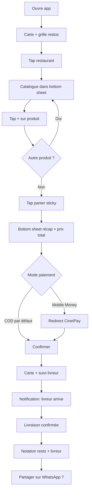
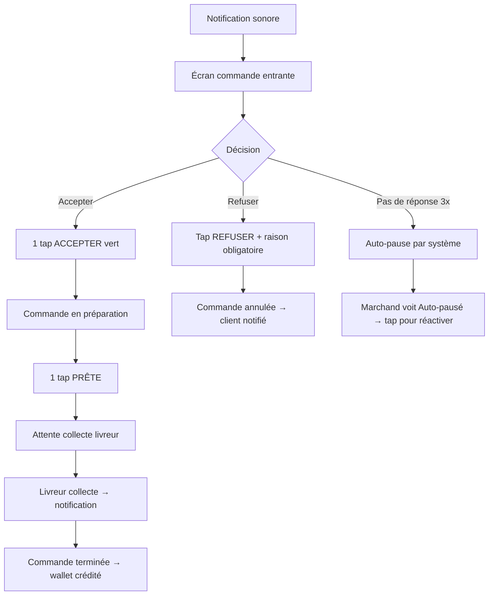
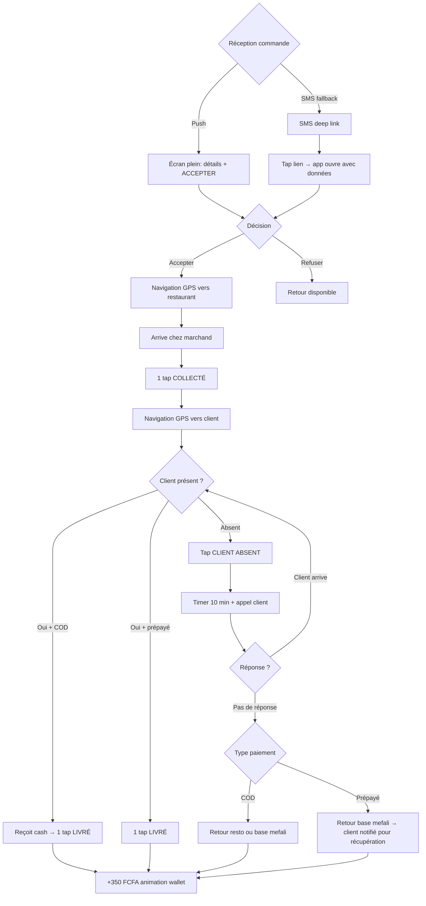
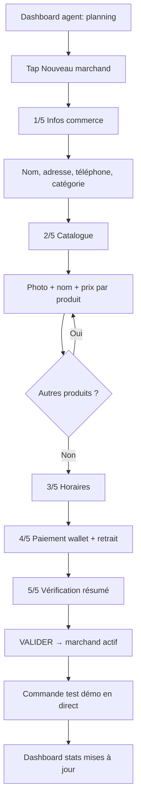
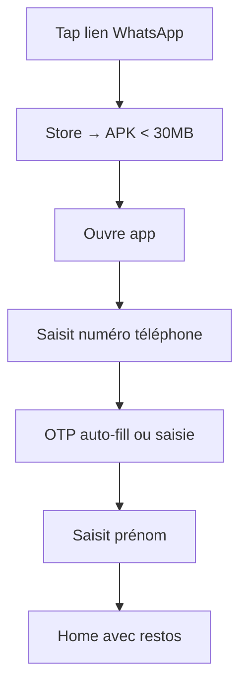

# UX Design Specification mefali

**Author:** Angenor
**Date:** 2026-03-16

---

<!-- UX design content will be appended sequentially through collaborative workflow steps -->

## Executive Summary

### Project Vision

mefali est un super app multi-plateforme (4 apps Flutter) pour la Côte d'Ivoire, ciblant les 87% d'économie informelle. Le défi UX central : concevoir 4 interfaces distinctes pour 4 profils d'utilisateurs radicalement différents (commerçante 42 ans sur Tecno Spark vs fonctionnaire 27 ans sur Samsung A14) — tout en partageant une identité visuelle et des packages Flutter communs.

**Contrainte hardware dominante :** Smartphones Transsion (Tecno, Infinix, Itel) — 2 GB RAM, écrans 720p, stockage limité, réseau 3G instable. Le design doit être performant AVANT d'être beau.

### Target Users

| App | Persona | Device | Littératie digitale | Contexte d'usage |
|-----|---------|--------|-------------------|-----------------|
| B2C | Koffi, 27 ans, fonctionnaire | Samsung A14 | Moyenne | Chez lui le soir, détendu, veut commander vite |
| B2B/ERP | Maman Adjoua, 42 ans, restauratrice | Tecno Spark | Faible | En cuisine, mains occupées, bruit, interruptions constantes |
| Livreur | Koné, 24 ans, moto | Itel A58 | Faible-moyenne | En mouvement, une main sur le guidon, soleil, réseau instable |
| Admin | Fatou/Awa, 29-31 ans, agents | Smartphone fourni / Web | Moyenne-haute | Bureau ou terrain, multitâche |

### Key Design Challenges

1. **Littératie digitale variable** — Adjoua n'a jamais utilisé d'ERP. Chaque écran doit être compréhensible sans explication. L'agent terrain fait la première démo, mais après, elle est seule.

2. **Usage en conditions hostiles** — Koné conduit une moto, le soleil tape sur l'écran, le réseau tombe. L'app Livreur doit fonctionner avec des gros boutons, un contraste fort, et zero friction même offline.

3. **Confiance à bâtir de zéro** — 80% du marché préfère le COD par manque de confiance. Chaque écran de paiement doit respirer la transparence (prix total affiché, escrow expliqué, tracking visible).

4. **4 apps ≠ 4 UX séparés** — Monorepo Flutter avec packages partagés. Le design system doit être unifié (couleurs, typo, composants) mais chaque app a ses propres flows et priorités.

5. **Performance = UX** — APK < 30 MB, images WebP < 200 KB, animations réduites sur 2 GB RAM. Un écran qui met > 3s à charger est un écran que Maman Adjoua ne reverra jamais.

### Design Opportunities

1. **Le "aha moment" de Maman Adjoua** — Le dashboard ventes hebdomadaire est l'écran le plus important de toute la plateforme. Si on le rend immédiatement lisible et actionnable, elle revient chaque semaine. C'est la conversion ERP → fidélité.

2. **Le suivi temps réel pour Koffi** — La carte avec le point bleu qui avance élimine l'anxiété. C'est le moment où Koffi se dit "ça marche vraiment". Design opportunity : rendre ce suivi satisfaisant visuellement (pas juste fonctionnel).

3. **La notification "+350 FCFA" de Koné** — Le paiement instantané est le différenciateur émotionnel #1. Le feedback visuel de crédit wallet doit être célébratoire — c'est le moment qui fidélise le livreur.

4. **L'onboarding agent terrain** — Fatou est la porte d'entrée de tout l'écosystème. Son flow d'onboarding marchand (< 30 min) doit être un outil de vente en soi — montrer la valeur pendant l'installation.

## Core User Experience

### Defining Experience

**Le core loop de mefali :**

```
Koffi commande → Adjoua prépare → Koné livre → Koffi confirme → Tout le monde est payé
```

Ce loop doit tourner en < 45 minutes de bout en bout. Chaque friction dans ce loop = un client perdu, un marchand déçu, un livreur qui quitte.

**Priorité UX : App B2C (Koffi) en premier.** C'est l'app qui génère les commandes et le revenu. Si Koffi a une mauvaise expérience, il ne revient pas — et sans commandes, Adjoua et Koné n'ont aucune raison de rester.

**Core action par app :**

| App | Core action | Temps cible | Interaction minimale |
|-----|------------|-------------|---------------------|
| B2C (Koffi) | Commander un repas | < 60s de l'ouverture à la confirmation | Browse → add → payer → terminé |
| B2B (Adjoua) | Gérer une commande entrante | < 10s pour accepter | 1 tap "Accepter", 1 tap "Prêt" |
| Livreur (Koné) | Accepter et livrer | < 5s pour accepter | 1 tap "Accepter", 1 tap "Collecté", 1 tap "Livré" |
| Admin (Fatou) | Onboarder un marchand | < 30 min guidé | Flux step-by-step linéaire |

### Platform Strategy

**4 apps Flutter, 1 design system partagé :**

| Aspect | Décision |
|--------|---------|
| Framework | Flutter (Dart) — iOS + Android, monorepo |
| App Admin | Flutter Web (pas native) |
| Design system | Partagé via packages Flutter (couleurs, typo, composants) |
| Interactions | Touch-first (gros boutons, swipe), pas de hover |
| Offline | App Livreur = offline-native, App B2B = offline-capable, App B2C = online required (paiement) |
| Orientation | Portrait uniquement (toutes apps) |
| Taille cible zone tap | ≥ 48px (recommandation Material Design, critique pour Koné en mouvement) |

**Contraintes hardware à respecter dans CHAQUE écran :**
- 720p minimum (pas de layouts qui cassent sous 1080p)
- Animations : réduites ou désactivées si RAM < 3 GB
- Images : WebP, lazy load, max 200 KB
- Pas de vidéo inline (trop lourd pour data + device)

### Effortless Interactions

**App B2C — Ce qui doit être invisible :**
- Le prix total (plat + livraison) apparaît AVANT de confirmer — zéro surprise
- Le paiement COD est l'option par défaut — un tap, pas un choix dans un menu
- Le suivi GPS démarre automatiquement après confirmation — pas besoin d'aller le chercher
- Le restaurant le plus proche apparaît en premier — pas de scroll infini

**App B2B — Ce qui doit être 1 tap :**
- "Nouvelle commande" = notification sonore + écran qui s'ouvre
- "Accepter" = 1 gros bouton vert
- "Refuser" = accessible mais pas au même niveau (éviter les refus accidentels)
- "Prête" = 1 gros bouton quand c'est le moment — pas avant

**App Livreur — Ce qui doit marcher les yeux fermés :**
- Accepter une course = 1 bouton plein écran
- Le numéro du client = un tap pour appeler (pas copier-coller)
- "Client absent" = un bouton, pas un menu de 3 sous-options
- La confirmation de livraison = 1 tap, feedback immédiat "+X FCFA"

**Cross-app — Ce qui doit être automatique :**
- Le SMS fallback part seul si le push échoue (Koné ne fait rien)
- L'escrow se libère automatiquement à la confirmation — pas d'action marchand
- La synchronisation offline → serveur est silencieuse et transparente

### Critical Success Moments

| Moment | App | Pourquoi c'est critique | Design implication |
|--------|-----|------------------------|-------------------|
| **Première commande réussie** | B2C | Koffi décide s'il revient ou non | Flow d'achat < 60s, prix transparent, tracking satisfaisant |
| **"+350 FCFA" notification** | Livreur | Koné décide si cette app vaut le coup | Feedback visuel célébratoire, montant gros et clair |
| **Dashboard ventes vendredi soir** | B2B | Adjoua comprend la valeur de l'ERP | Chiffres lisibles sans explication, comparaison semaine précédente |
| **Onboarding < 30 min** | Admin | Fatou convainc le prochain marchand ou non | Flux linéaire, progress bar visible, résultat immédiat |
| **SMS commande reçu offline** | Livreur | Koné peut travailler même sans data | Lien cliquable, toutes les infos dans le SMS, zéro friction |

### Experience Principles

1. **"1 tap, pas 3"** — Chaque action critique doit être faisable en 1 interaction. Si ça demande 3 taps, c'est un bug de design.

2. **"Montre le prix, toujours"** — Le prix total est visible à chaque étape. Jamais de surprise au checkout. La confiance se construit par la transparence.

3. **"Le réseau n'est pas un prérequis"** — L'app doit rester utile même quand le réseau tombe. SMS, cache, sync différée — le design ne doit jamais montrer un écran vide.

4. **"Célèbre les petites victoires"** — Paiement reçu, commande livrée, premier rapport de ventes — chaque milestone mérite un feedback visuel positif.

5. **"Conçu pour le soleil et le bruit"** — Contraste fort, gros boutons, notifications sonores. L'app marche dans une cuisine bruyante ou sur une moto en plein midi.

## Desired Emotional Response

### Primary Emotional Goals

**Confiance + Empowerment** — les deux piliers émotionnels de mefali.

- **Confiance :** "Ici tout est clair, transparent, pas d'arnaque." Chaque interaction doit renforcer la certitude que mefali est fiable — prix affichés, escrow expliqué, livreur visible sur la carte, paiement instantané vérifié.

- **Empowerment :** "Je suis en train de devenir un professionnel." L'app ne fait pas les choses POUR l'utilisateur — elle lui donne les outils pour les faire MIEUX. Adjoua ne reçoit pas un conseil générique, elle voit SES chiffres et prend SA décision.

### Emotional Journey Mapping

| Étape | Koffi (B2C) | Adjoua (B2B) | Koné (Livreur) |
|-------|------------|-------------|----------------|
| **Découverte** | Curiosité → "un ami m'a dit que ça marche" | Scepticisme → "encore une app qui va prendre mon argent ?" | Méfiance → "Jumia a fermé et bloqué nos sous" |
| **Premier usage** | Surprise → "c'est rapide et le prix est clair" | Étonnement → "c'est gratuit et ça marche sur mon Tecno ?" | Soulagement → "j'ai été payé tout de suite" |
| **Usage régulier** | Confiance → "je commande sans hésiter" | Empowerment → "je sais ce qui se vend le mieux" | Fierté → "je gagne ma vie correctement" |
| **Problème rencontré** | Sécurité → "ils ont résolu mon litige en 20 min" | Respect → "on ne m'a pas puni, on a compris" | Protection → "j'ai été payé même quand le client n'était pas là" |
| **Fidélisation** | Appartenance → "c'est mon app, je la recommande" | Croissance → "mon business a changé depuis mefali" | Stabilité → "j'ai des courses régulières et je parraine des amis" |

### Micro-Emotions

**À cultiver :**

| Micro-émotion | Où elle se manifeste | Design trigger |
|--------------|---------------------|---------------|
| **Certitude** | Écran de paiement | Prix total visible, breakdown clair, pas de frais cachés |
| **Accomplissement** | Dashboard ventes Adjoua | Chiffres en hausse vs semaine précédente, indicateur vert |
| **Gratification immédiate** | "+350 FCFA" Koné | Animation de crédit wallet, son de notification positif |
| **Sérénité** | Suivi livraison Koffi | Point bleu qui avance, ETA affiché, pas de doute |
| **Compétence** | Gestion stock Adjoua | "Stock bas" alerté avant la rupture — elle a anticipé |
| **Autonomie** | Retrait wallet Koné | "Retirer vers Orange Money" → argent en 2 min, pas de permission à demander |

**À éviter absolument :**

| Émotion toxique | Cause typique chez les concurrents | Comment mefali l'évite |
|----------------|-----------------------------------|----------------------|
| **Trahison** | Jumia ferme et bloque les gains | Paiement immédiat, wallet retirable à tout moment |
| **Impuissance** | Glovo impose 35-43%, pas de recours | Commission transparente, zéro exclusivité |
| **Confusion** | Frais cachés révélés au checkout | Prix total affiché AVANT confirmation |
| **Anxiété** | "Ma commande est où ?" | Tracking temps réel, notifications proactives |
| **Humiliation** | Refus de commande sans explication | Message clair si produit indisponible, suggestion alternative |

### Design Implications

| Émotion cible | Implication design |
|--------------|-------------------|
| **Confiance** | Transparence = tout est visible (prix, tracking, historique, notes). Pas de menu caché, pas de "conditions générales" en petits caractères |
| **Empowerment** | L'app montre des données actionnables (pas juste des chiffres). "Ton garba se vend 3× plus le vendredi" → l'utilisateur sait quoi faire |
| **Gratification** | Feedback instantané et célébratoire : animation "+X FCFA", son positif, badge "commande livrée" |
| **Sécurité** | Le protocole client absent protège le livreur AVANT qu'il se plaigne. L'escrow protège le client AVANT qu'il paie. La protection est proactive, pas réactive |
| **Autonomie** | Zéro permission à demander : retirer son argent, changer ses horaires, refuser une commande — tout est en 1 tap sans validation externe |

### Emotional Design Principles

1. **"La confiance se montre, elle ne se dit pas"** — Pas de texte "nous sommes fiables". Montrer le prix total, le tracking en direct, le paiement instantané. L'action prouve la confiance.

2. **"Les données sont un super-pouvoir"** — Chaque chiffre affiché doit aider l'utilisateur à prendre une meilleure décision. Si un chiffre n'est pas actionnable, il ne devrait pas être affiché.

3. **"Protège avant qu'on te le demande"** — L'escrow, le protocole client absent, le SMS fallback — tout doit être actif AVANT que le problème arrive. L'utilisateur ne doit jamais avoir à demander de l'aide pour un cas prévisible.

4. **"Chaque franc gagné mérite une célébration"** — Le feedback positif n'est pas superficiel. Pour Koné qui gagne 350 FCFA par course, cette notification est le moment émotionnel le plus important de sa journée. La traiter comme telle.

5. **"Jamais d'écran vide, jamais d'impasse"** — Si le réseau tombe, l'app montre les données cachées. Si un produit est indisponible, elle propose une alternative. Pas de dead-end, pas de "erreur, réessayez plus tard".

## UX Pattern Analysis & Inspiration

### Inspiring Products Analysis

#### Yango — Bottom Sheet & Map Picker

**Ce qu'ils font bien :**
- **Bottom sheet progressif** pour sélection adresse : d'abord le lieu de prise en charge, puis la destination. L'information se révèle progressivement sans quitter la carte.
- **Map picker comme fallback** : quand l'autocomplétion ne trouve pas l'adresse, l'utilisateur pose un pin sur la carte. Critique pour la CI où les adresses formelles sont rares.
- **Options + prix dans le bottom sheet** : après sélection des adresses, les options apparaissent dans le même bottom sheet. Pas de navigation vers un nouvel écran.

**Pertinence pour mefali :** Le flow B2C peut adopter ce pattern : bottom sheet pour sélection restaurant → panier → confirmation, ancré sur la carte locale. Le map picker est essentiel à Bouaké où l'autocomplete sera incomplet.

#### Glovo — Homepage & Catalogue

**Ce qu'ils font bien :**
- **Homepage épurée :** adresse en haut → icônes services → recommandations → bottom nav. Hiérarchie visuelle claire.
- **Style d'affichage** : cartes propres avec image, nom, note, temps de livraison. Lisible d'un coup d'œil.

**Ce qui ne marchera PAS :** Scrolls horizontaux dans la page restaurant — non intuitif pour les utilisateurs non-tech. À remplacer par des listes verticales ou grilles.

#### WhatsApp — Référence universelle CI

- Liste verticale scrollable, icônes rondes, onglets en haut
- Le mental model UX que 100% de nos users connaissent déjà

#### Orange Money — Transaction flow de confiance

- Confirmation avant exécution, PIN pour valider, récapitulatif clair du montant
- Le flow de paiement mefali doit reproduire cette sensation de contrôle

### Transferable UX Patterns

| Pattern | Source | Usage dans mefali | App(s) |
|---------|--------|------------------|--------|
| **Bottom sheet progressif** | Yango | Flow commande B2C : restaurant → panier → paiement → suivi | B2C |
| **Map picker (pin sur carte)** | Yango | Sélection adresse quand autocomplete échoue | B2C, Livreur |
| **Homepage épurée** | Glovo | Accueil B2C : adresse → catégories → restos → nav | B2C |
| **Cartes restaurant** | Glovo | Image + nom + note + ETA. Sans scroll horizontal. | B2C |
| **Liste verticale** | WhatsApp | Navigation principale — pattern universel en CI | Toutes |
| **Tabs en haut** | WhatsApp | Navigation B2B (Commandes / Catalogue / Dashboard) | B2B |
| **Flow confirmation** | Orange Money | Récapitulatif → "Confirmer" → feedback positif | B2C, Livreur |
| **Gros bouton d'action** | Yango/Uber | "Commander", "Accepter", "Livré" — pleine largeur | Toutes |

### Anti-Patterns to Avoid

| Anti-pattern | Pourquoi c'est dangereux | Alternative mefali |
|-------------|------------------------|-------------------|
| **Scroll horizontal** | Non intuitif pour non-tech, contenu caché | Grille 2 colonnes ou liste verticale |
| **Burger menu (☰)** | Cache la navigation, confus pour débutants | Bottom navigation bar visible (max 4-5 items) |
| **Formulaire inscription long** | Taux d'abandon massif | Phone + OTP uniquement (30 secondes) |
| **Map plein écran sans contexte** | Désorientant sur 720p | Carte (60%) + bottom sheet (40%) |
| **Texte dense sans visuel** | Adjoua ne lira pas un paragraphe | Icônes + chiffres + couleurs |
| **Notifications sans valeur** | "Vous nous manquez!" = désinstallation | Notifications pour actions réelles uniquement |
| **Mode sombre sans contraste suffisant** | Illisible en plein soleil | Les 2 modes respectent WCAG AA, mode clair recommandé en extérieur |

### Design Inspiration Strategy

**Adopter :**
- Bottom sheet progressif (Yango) pour le flow B2C
- Homepage structure (Glovo) : adresse → catégories → recommandations
- Gros boutons pleine largeur pour actions critiques
- Phone + OTP pour inscription

**Adapter :**
- Cartes restaurant Glovo → grille 2 colonnes (pas scroll horizontal)
- Map picker Yango → bouton "Utiliser ma position" proéminent
- Tabs WhatsApp → contextes B2B (Commandes / Catalogue / Stats)

**Éviter :**
- Scroll horizontal, burger menu, mode sombre par défaut
- Animations lourdes, onboarding tutorial slides

## Design System Foundation

### Design System Choice

**Material Design 3 (M3) + Thème custom centralisé**

Flutter intègre Material 3 nativement. Les composants sont éprouvés, accessibles, et correspondent au look Android que 60%+ des users connaissent sur leurs Transsion. Pas de dépendance externe.

### Rationale for Selection

| Critère | Material 3 + custom theme |
|---------|--------------------------|
| Vitesse de dev | Composants prêts à l'emploi (buttons, cards, sheets, nav) |
| Cible device | Look natif Android = familier pour Transsion users |
| Accessibilité | Touch targets 48px, contrastes, et a11y intégrés |
| Customisation | ColorScheme + TextTheme + composants custom si besoin |
| Maintenance | 1 fichier de thème = modification globale instantanée |
| Performance | Natif Flutter, pas de bridge ou lib externe lourde |

### Implementation Approach

**Architecture thème centralisé — 1 fichier, 4 apps :**

```
packages/
  mefali_design/
    lib/
      mefali_theme.dart      ← LE fichier unique (couleurs, typo, formes)
      mefali_colors.dart      ← Palette centralisée
      mefali_typography.dart  ← Styles texte
      mefali_components.dart  ← Composants custom partagés
```

**Principe : changer `mefali_theme.dart` modifie les 4 apps simultanément.** Aucune couleur, aucun style ne doit être codé en dur dans les apps — tout passe par le package `mefali_design`.

### Customization Strategy

**Palette initiale — Marron (modifiable en 1 variable) :**

| Token | Valeur indicative | Usage |
|-------|------------------|-------|
| `primary` | Marron foncé (~#5D4037 / Brown 700) | Boutons principaux, app bar, accents forts |
| `primaryContainer` | Marron clair (~#D7CCC8 / Brown 100) | Fonds de cartes, sélections, highlights |
| `onPrimary` | Blanc (#FFFFFF) | Texte sur boutons marron foncé |
| `onPrimaryContainer` | Marron foncé | Texte sur fonds marron clair |
| `error` | Rouge M3 standard | Alertes, erreurs |
| `success` | Vert (#4CAF50) | "+350 FCFA", confirmations, stock OK |
| `surface` | Blanc cassé (#FAFAFA) | Fond d'écran principal |
| `onSurface` | Gris très foncé (#212121) | Texte body |

> **Note :** Ces valeurs sont des points de départ. Changer la palette entière = modifier 4-6 variables dans `mefali_colors.dart`.

**Contraintes :**
- Contraste marron foncé sur blanc ≥ 4.5:1 (WCAG AA)
- Mode clair + mode sombre dès le MVP (ThemeMode.system par défaut)
- Touch target minimum 48×48 dp
- Taille texte minimum 14sp body, 12sp labels
- Police : Roboto (défaut Flutter, lisible sur petit écran) — modifiable en 1 ligne

**Composants custom (hors M3 standard) :**
- Bottom sheet progressif style Yango (commande B2C)
- Carte restaurant en grille 2 colonnes
- Notification célébratoire "+X FCFA" (animation légère, son)
- Widget 4 états disponibilité marchand
- Écran map picker avec bottom sheet 40/60

## Design Direction Decision

### Chosen Direction

**"Clean Utility" → évoluant vers une identité culturelle ivoirienne**

**MVP :** Material 3 standard avec palette marron — fonctionnel, fiable, rapide à développer.
**Post-MVP :** Customisation progressive du M3 vers une identité visuelle originale, ancrée dans la culture ivoirienne.

| Principe | MVP | Évolution post-MVP |
|----------|-----|-------------------|
| Style visuel | Material 3 standard | Composants custom culturellement ancrés |
| Palette | Marron foncé/clair | Palette enrichie (motifs, textures) |
| Typographie | Roboto (défaut Flutter) | Police custom possible (1 variable) |
| Iconographie | Material Icons standard | Icônes custom inspirées de l'art ivoirien |

### Design Direction par App

**App B2C — Architecture multi-services anticipée :**

**MVP (food uniquement) :** Le ServiceGrid est masqué (1 seul service). L'utilisateur voit directement la grille restaurants.
```
┌─────────────────────┐
│ 📍 Quartier Commerce ▼│
├─────────────────────┤
│ 🍖 Garba | 🍗 Poulet │  ← Filtres catégories food
├─────────────────────┤
│ ┌─────┐ ┌─────┐    │  ← Grille 2 colonnes
│ │Adjoua│ │Resto │    │
│ │★4.7  │ │★4.5  │    │
│ │15min │ │20min │    │
│ └─────┘ └─────┘    │
├─────────────────────┤
│ 🏠  🔍  📦  👤      │  ← Bottom nav
└─────────────────────┘
```

**Post-MVP (multi-services, style Glovo) :** Le ServiceGrid apparaît automatiquement dès qu'un 2ème service est ajouté. Pas de refonte.
```
┌─────────────────────┐
│ 📍 Quartier Commerce ▼│
├─────────────────────┤
│ 🍽️       💊       🛒 │
│Restaurant Pharmacie Boutique│
│ 🏍️       📦       ...│
│ Courses  Colis     +  │  ← Extensible
├─────────────────────┤
│ Recommandés pour toi │
│ ┌─────┐ ┌─────┐    │
│ └─────┘ └─────┘    │
├─────────────────────┤
│ 🏠  🔍  📦  👤      │
└─────────────────────┘
```

**Structure code :** `HomePage → ServiceGrid → ServicePage → RestaurantGrid`

**App B2B (Adjoua) :**
```
┌─────────────────────┐
│ mefali B2B    ● Ouvert│
├─────────────────────┤
│ Commandes|Catalogue|Stats│
├─────────────────────┤
│ 🔔 Nouvelle ! 2500F ││
│ [ACCEPTER]          ││
│ En préparation      ││
│ [PRÊTE ✓]           ││
└─────────────────────┘
```

**App Livreur (Koné) :**
```
┌─────────────────────┐
│    [CARTE GPS 60%]  │
├─────────────────────┤
│ Adjoua → Qrt Commerce│
│ 800m · ~7 min · 350F│
│ [  ACCEPTER  ]      │
└─────────────────────┘
```

**App Admin (Fatou/Awa) :** Dashboard web responsive, nav latérale, vue commandes/marchands/livreurs/litiges.

### Pricing Strategy — Impact UX

**Tarification livraison dynamique par ville :**

Le prix de livraison = `distance_base × multiplicateur_ville`, configurable dans le backoffice Admin.

**Rationale :**
- Bouaké ≠ Abidjan ≠ San-Pédro — pouvoir d'achat différent
- À Abidjan (Phase 3) : multiplicateur calibré pour être compétitif vs Glovo/Yango
- Villes intérieures : multiplicateur reflète le niveau de vie local

**Impact UX :**
- Le prix de livraison est visible sur chaque carte restaurant AVANT le tap
- FR53 étendu : Admin configure zones de livraison **et multiplicateur tarifaire** par ville
- Le prix affiché est toujours le prix final — pas de surprise

### Design Rationale

1. **M3 = fondation, pas destination** — MVP livre vite. L'identité culturelle viendra en customisant composant par composant.
2. **Architecture multi-services dès le MVP** — `ServiceGrid` caché quand 1 service, visible dès 2+. Pas de refonte.
3. **Prix dynamique par ville** — levier stratégique pour la compétitivité à Abidjan, pas juste un paramètre technique.

## Defining Experience

### The One Interaction

**App B2C (Koffi) — l'expérience qui définit mefali :**

> "J'ouvre l'app, je vois les restos autour de moi, je tape sur un plat, je confirme, et je vois le livreur arriver sur la carte."

Si on rate ce flow, rien d'autre ne compte. Si on le réussit, Koffi envoie le lien WhatsApp à ses amis le soir même.

**Les autres apps ont leur propre "defining moment" :**
- **B2B (Adjoua)** : "Mon téléphone sonne, j'accepte, je prépare, c'est parti." → La commande entrante qui fait sonner le téléphone.
- **Livreur (Koné)** : "J'accepte, je livre, je suis payé." → Le "+350 FCFA" instantané.
- **Admin (Fatou)** : "Je montre l'app au marchand, en 20 minutes il est inscrit et reçoit sa première commande test." → L'onboarding comme démo live.

### User Mental Model

**Comment les utilisateurs résolvent le problème AUJOURD'HUI :**

| Étape | Méthode actuelle (WhatsApp) | Mental model |
|-------|---------------------------|-------------|
| Choisir un resto | Demander à un ami ou passer devant | Bouche-à-oreille, proximité physique |
| Commander | Envoyer un vocal WhatsApp au resto | Conversation directe, négociation |
| Payer | Cash en main au livreur ou au comptoir | "Je vois l'argent partir, je contrôle" |
| Suivre | Rappeler le resto "c'est bientôt prêt ?" | Aucune visibilité, anxiété |

**Mental model que mefali respecte :**
- Le cash reste le réflexe → COD par défaut
- La conversation directe = confiance → numéro du livreur accessible
- La proximité physique = découverte → restos proches d'abord
- Le contrôle sur l'argent → prix total visible AVANT

**Mental model que mefali introduit (innovation douce) :**
- Suivi temps réel → remplace le "rappeler le resto". Nouveau mais immédiatement compris
- Escrow → invisible pour l'utilisateur. Il voit juste que tout fonctionne

### Success Criteria for Core Experience

| Critère | Mesure | Seuil |
|---------|--------|-------|
| Commande sans hésitation | Temps ouverture → confirmation | < 60 secondes |
| Pas de surprise checkout | Taux d'abandon écran paiement | < 15% |
| Le suivi rassure | % clients qui ouvrent le tracking | > 70% |
| Livraison comme promis | Livraison dans fenêtre ETA | > 85% |
| Koffi revient | Retour à J+30 | > 40% |
| Koffi partage | Envoi lien WhatsApp | > 20% des actifs |

### Novel UX Patterns

**Established (pas d'éducation nécessaire) :** Liste restaurants, bottom nav, carte avec livreur, bouton CTA

**Adaptés pour le contexte CI :** Bottom sheet progressif (Yango → food), map picker avec "Ma position" proéminent, grille 2 colonnes (pas scroll horizontal)

**Innovations invisibles (0 éducation car automatiques) :** Escrow en arrière-plan, SMS fallback automatique, 4 états marchand ("Débordé ~30 min" au lieu de "Fermé")

### Experience Mechanics — Flow B2C

**1. Initiation :**
```
App ouvre → Carte locale + bottom sheet "Restos près de toi"
Pas de splash screen, pas de tutorial. Directement le contenu.
```

**2. Découverte :**
```
Grille 2 colonnes : [Photo | Nom | Note ★ | ETA min]
Filtre rapide en haut : Tout | Garba | Poulet | Jus | ...
Tap sur un resto → catalogue s'ouvre dans le bottom sheet
```

**3. Commande :**
```
Catalogue vertical : [Photo | Nom | Prix]
Tap "+" pour ajouter au panier
Panier sticky en bas : "2 articles — 3 000 FCFA → Commander"
```

**4. Confirmation :**
```
Bottom sheet récapitulatif :
  Garba + alloco     1 500 FCFA
  Jus gingembre        500 FCFA
  Livraison            500 FCFA
  ─────────────────────────────
  TOTAL              2 500 FCFA

[● Cash à la livraison]  (par défaut, pré-sélectionné)
[○ Mobile Money]

[  CONFIRMER — 2 500 FCFA  ]  ← Gros bouton marron foncé
```

**5. Suivi :**
```
Carte plein écran + bottom sheet état :
  "Adjoua prépare votre commande..."  → icône cuisine
  "Koné est en route !"              → point bleu sur carte + ETA
  "Koné arrive dans 2 minutes"       → notification push

Tap sur Koné → voir numéro, appeler directement
```

**6. Complétion :**
```
Koné confirme livraison côté livreur
Koffi voit : "Commande livrée ✓"
Bottom sheet : "Comment c'était ?"
  ★★★★★ Adjoua    ★★★★★ Koné
  [Partager mefali sur WhatsApp]
```

## User Journey Flows

### Flow 1 — Koffi commande un repas (B2C)

> Détaillé en section "Experience Mechanics". Résumé :



**6 écrans. Temps cible : ouverture → confirmation < 60s.**

---

### Flow 2 — Adjoua gère une commande (B2B)



**Écrans clés :**

| Écran | Action principale |
|-------|------------------|
| Commande entrante | ACCEPTER (vert, gros) |
| En préparation | PRÊTE ✓ (quand terminé) |
| Tab Commandes | Scroll vertical, tabs état |

**Son distinctif mefali** pour nouvelle commande — Adjoua doit l'entendre depuis la cuisine.

---

### Flow 3 — Koné accepte et livre (Livreur)



**Koné est payé dans TOUS les cas.** Le flow client absent a 2 branches : COD (retour resto ou base) vs prépayé (toujours retour base mefali).

---

### Flow 4 — Fatou onboarde un marchand (Admin)



**Progress bar 1/5 → 5/5 visible.** La commande test finale = l'outil de vente qui convainc le marchand.

---

### Flow 5 — Koffi s'inscrit (B2C first-time)



**< 30 secondes. 3 écrans. 0 email, 0 mot de passe.**

---

### Journey Patterns

| Pattern | Usage | Apps |
|---------|-------|------|
| **1 tap action** | Accepter, Refuser, Prêt, Livré, Collecté | B2B, Livreur |
| **Bottom sheet progressif** | Détails étape par étape | B2C, Livreur |
| **Progress bar linéaire** | Onboarding marchand 5 étapes | Admin |
| **Notification → action directe** | Push/SMS → écran d'action | B2B, Livreur |
| **Feedback célébratoire** | Animation + son après paiement | Livreur, B2C |
| **Fallback invisible** | SMS si push échoue, cache si réseau tombe | Livreur, B2B |

### Flow Optimization Principles

1. **Zéro écran intermédiaire** — Notification ouvre directement l'écran d'action
2. **Le flow d'erreur protège, pas punit** — Client absent = Koné payé. Auto-pause = Adjoua réactive en 1 tap
3. **Le premier flow = flow de conviction** — Inscription 30s, onboarding démo live
4. **Chaque flow finit par un feedback positif** — Commande notée, wallet crédité, marchand activé

## Component Strategy

### Design System Components (M3 Flutter — utilisés tels quels)

| Composant M3 | Usage mefali |
|-------------|-------------|
| `FilledButton` | CTA principaux (Commander, Accepter, Livré) |
| `OutlinedButton` | Actions secondaires (Refuser, Annuler) |
| `Card` | Base pour RestaurantCard, OrderCard |
| `BottomNavigationBar` | Nav principale B2C (4 items) |
| `TabBar` | Tabs B2B (Commandes/Catalogue/Stats) |
| `AppBar` | Barre supérieure toutes apps |
| `TextField` / `SearchBar` | Recherche restaurants, saisie catalogue |
| `SnackBar` | Confirmations rapides |
| `LinearProgressIndicator` | Onboarding agent terrain |
| `ListTile` | Listes verticales |
| `Chip` | Filtres catégories food |
| `Badge` | Compteur notifications |

### Custom Components (10 dans `mefali_design`)

#### 1. MefaliBottomSheet (progressif)
**Purpose :** Bottom sheet 3 états (peek 25% / half 50% / expanded 85%) style Yango
**Usage :** Flow commande B2C, détails course Livreur
**Priorité :** Semaine 1-2 — critique

#### 2. RestaurantCard
**Purpose :** Carte grille 2 colonnes — photo, nom, note ★, ETA, prix livraison dynamique
**States :** Default, indisponible (grisé), débordé (badge orange "~30 min")
**Priorité :** Semaine 1-2 — critique

#### 3. OrderCard (B2B)
**Purpose :** Commande entrante pour Adjoua — produits, montant, actions
**States :** Nouvelle (highlight + son), acceptée, prête, terminée
**Actions :** ACCEPTER (vert gros), REFUSER (petit texte), PRÊTE ✓
**Priorité :** Semaine 2-3 — critique

#### 4. DeliveryMissionCard
**Purpose :** Proposition de course pour Koné
**Content :** Restaurant → destination, distance, ETA, gain livreur
**Actions :** ACCEPTER (pleine largeur marron), timeout auto-dismiss 30s
**Priorité :** Semaine 2-3 — critique

#### 5. WalletCreditFeedback
**Purpose :** Animation "+X FCFA" célébratoire après livraison
**Behaviour :** Scale-up montant + son + vibration. 2s. Auto-dismiss.
**Priorité :** Semaine 5-6 — important (différenciateur émotionnel)

#### 6. VendorStatusIndicator
**Purpose :** Pastille 4 états (ouvert/débordé/auto-pausé/fermé)
**Behaviour :** Interactif en B2B (tap pour changer), read-only en B2C
**Priorité :** Semaine 4-5 — critique

#### 7. OrderTimeline
**Purpose :** Timeline horodatée commande pour résolution litiges Admin
**States :** Complétée (vert), en cours (marron pulsant), future (gris)
**Priorité :** Semaine 5-6 — important

#### 8. PriceBreakdownSheet
**Purpose :** Récapitulatif prix transparent — articles + livraison + total
**Rule :** Le total est le texte le plus gros de l'écran. Zéro frais caché.
**Priorité :** Semaine 4-5 — critique (confiance)

#### 9. DeliveryTracker
**Purpose :** Carte Google Maps + marker livreur temps réel + ETA
**Updates :** Position toutes les 10s (NFR7)
**Priorité :** Semaine 3-4 — critique

#### 10. MapAddressPicker
**Purpose :** Sélection adresse sur carte quand autocomplete échoue
**Key feature :** Bouton "Utiliser ma position" proéminent + pin central drag
**Priorité :** Semaine 3-4 — critique (adresses informelles CI)

### Component Implementation Timeline

| Semaines | Composants | Bloquant pour |
|----------|-----------|--------------|
| 1-2 | MefaliBottomSheet, RestaurantCard | Flow B2C complet |
| 2-3 | OrderCard, DeliveryMissionCard | Flow B2B + Livreur |
| 3-4 | DeliveryTracker, MapAddressPicker | Suivi + adresses |
| 4-5 | VendorStatusIndicator, PriceBreakdownSheet | Disponibilité + confiance |
| 5-6 | WalletCreditFeedback, OrderTimeline | Feedback + Admin |

**Règle :** Tous les composants custom dans `packages/mefali_design/lib/components/` — importables par les 4 apps.

## UX Consistency Patterns

### Button Hierarchy

| Niveau | Style M3 | Usage | Exemples |
|--------|---------|-------|----------|
| **Primaire** | `FilledButton` marron foncé, pleine largeur | Action critique, 1 par écran max | "Commander", "Accepter", "Livré" |
| **Secondaire** | `OutlinedButton` marron | Action alternative | "Refuser", "Modifier" |
| **Tertiaire** | `TextButton` | Action mineure | "Voir tout", "Passer" |
| **Danger** | `FilledButton` rouge | Action destructive | "Supprimer", "Désactiver" |

**Règles :** 1 seul primaire par écran. Toujours en bas (zone de pouce). Touch ≥ 48dp. Label = verbe d'action.

### Feedback Patterns

| Type | Visuel | Son | Durée |
|------|--------|-----|-------|
| **Succès** | SnackBar vert + ✓ | Court | 3s auto-dismiss |
| **Succès majeur** | WalletCreditFeedback "+X FCFA" | Célébratoire | 2s auto-dismiss |
| **Erreur** | SnackBar rouge + message clair | Non | Persistent |
| **Warning** | SnackBar orange | Non | 5s |
| **Loading** | Skeleton screen (pas de spinner seul) | Non | Jusqu'à chargement |
| **Nouvelle commande** | Push + écran plein + son custom | Son mefali | Persistent |

### Navigation Patterns

| App | Navigation principale | Navigation secondaire |
|-----|---------------------|---------------------|
| B2C | Bottom nav (Home, Recherche, Commandes, Profil) | Bottom sheet progressif |
| B2B | Tabs en haut (Commandes, Catalogue, Stats) | Liste scrollable par tab |
| Livreur | Carte plein écran + bottom sheet | Profil via icône |
| Admin | Nav latérale web | Breadcrumbs dans détails |

### Form Patterns

- Inscription : Phone + OTP uniquement (30s)
- Labels au-dessus du champ (pas en placeholder)
- Validation inline sous le champ en erreur
- Clavier adapté (numérique pour prix, texte pour noms)
- Tous les champs obligatoires sauf mention "(optionnel)"

### Empty States & Errors

- Jamais d'écran 100% vide → message humain + guidance
- Hors ligne → bandeau discret + contenu cache
- Erreur réseau → "On réessaie automatiquement" (pas de bouton retry)
- Erreur paiement → message clair + bouton Réessayer

### Notification Patterns

- Notifications uniquement pour événements actionnables
- Push livreur/B2B = TOUJOURS SMS fallback si push échoue
- Jamais de notifications promotionnelles ("Vous nous manquez !")

## Responsive Design & Accessibility

### Responsive Strategy

| App | Orientation | Breakpoints |
|-----|------------|-------------|
| B2C, B2B, Livreur | Portrait only | 320dp → 412dp (cœur) → 480dp |
| Admin | Responsive web | < 768px (mobile) → 768-1024 (tablet) → > 1024 (desktop) |

**Règles :** Grille 2 col → 1 col si < 340dp. Boutons CTA pleine largeur. Marges 16dp fixe.

### Mode Clair + Mode Sombre — les 2 dès le MVP

Le dark mode est une habitude forte des utilisateurs africains (économie batterie AMOLED, confort nocturne).

| Token | Mode clair | Mode sombre |
|-------|-----------|-------------|
| `primary` | Marron foncé #5D4037 | Marron clair #D7CCC8 |
| `primaryContainer` | Marron clair #D7CCC8 | Marron foncé #5D4037 |
| `surface` | Blanc cassé #FAFAFA | Gris très foncé #1C1B1F |
| `onSurface` | Gris foncé #212121 | Blanc cassé #E6E1E5 |
| `success` | Vert #4CAF50 | Vert clair #81C784 |
| `error` | Rouge #F44336 | Rouge clair #EF9A9A |

**Architecture :** `ThemeMode.system` par défaut (suit réglage téléphone) + toggle manuel dans settings. Les 2 thèmes dans `mefali_theme.dart`.

### Accessibility

| Critère | Standard | Statut |
|---------|----------|--------|
| Contraste texte | WCAG AA (4.5:1) | ✅ Les 2 modes |
| Touch targets | ≥ 48×48 dp | ✅ |
| Texte interactif | ≥ 14sp | ✅ |
| Feedback non-visuel | Son + vibration | ✅ |
| Offline | Bandeau + cache | ✅ |

**Accessibilité contextuelle :**

| Contexte | Solution |
|----------|---------|
| Plein soleil | Mode clair haut contraste |
| Cuisine bruyante | Son forte + vibration longue |
| Moto en mouvement | Boutons ≥ 56dp, 1 action/écran |
| Data instable | SMS fallback, cache, sync silencieuse |
| Faible littératie | Icônes + chiffres > texte, flow linéaire |

**Phase 2+ :** Lecteur d'écran (TalkBack/VoiceOver), taille texte dynamique.
